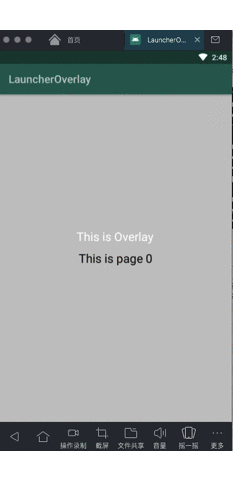

# LauncherOverlay

由于一项目需求，要实现一个桌面上负一屏的效果

在原有的android launcher中，设计额外的屏幕

## 项目APK及演示

[overlay apk](apk/overlay-debug.apk) : 独立存在的负一屏apk

[launcher apk](apk/launcher-debug.apk) : 模拟launcher apk，如果设备中存在上面`overlay apk`，会绑定Service，实现负一屏功能，滑动即可看到

演示分为两页，为了模拟滑动，滑动过程中负一屏会覆盖第0页

## 调研

调研一些手机厂商设计的Overlay，观察出有以下共性：

* 与launcher完全解耦，随时可以关闭，可以独立升级，在独立的app中
* 观察许多app的展示位，UI相同，数据不同，可知是app只提供了数据，套用Overlay中的模板

## 方案

基于以上观察到个共性，结合launcher需求，和google提供的LauncherOverlay、LauncherOverlayCallback接口，输出以下设计方案

### UI展示设计方案

为了和在launcher解耦，尽量让Overlay存在独立的进程中，和launcher互不影响，我们需要做的是让两个进程的UI在同一界面展示并且可以联动和交互，这里要使用到AIDL技术

现在分两端（客户端和服务端）来讨论，Launcher端（客户端）和Overlay端（服务端）

#### Launcher端

作为客户端，与Overlay端的服务通信，绑定Overlay端service，将何时启用、创建window等必要参数以及生命周期调用等告知服务端

#### Overlay端

独立进程，作为服务端，在Launcher中展示视图，这里Overlay中存在一个Service，负责和Launcher端通信，并且实现视图间的交互。Service由Launcher端绑定，使用Window提供视图展示，window使用Launcher端传来的token绑定，以便于同时展示交互

#### 两端交互

可以通过互传偏移量，实现滑动交互。将Launcher端滑动偏移量传给Overlay，服务端收到偏移量后调用Window中view的TranslationX方法，实现交互。

当然还可以使用其它方案实现交互，修改透明度等

### 数据方案

Overlay作为一个数据显示，不需要关心具体的业务逻辑，只提供显示和跳转，所以这些都应该从数据提供方获取。

维护一个数据库，使用ContentProvider作为数据收集和提供的中转站，数据提供方向Overlay插入或修改数据，Overlay只需监听数据库并展示

所以对外提供api，让数据提供方可以控制UI展示

* 定义显示优先级
* 提供几种模板样式供选择，严格控制插入数据库中的数据格式
* 跳转方式最好采用URI的方式，避免字段过多

